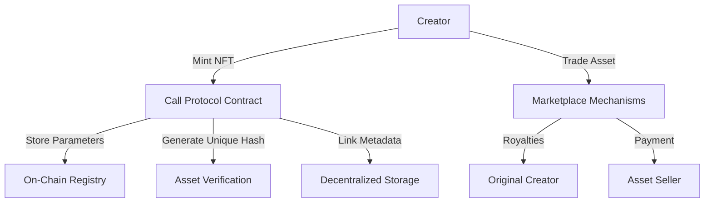

# Call Protocol NFT Platform

Call Protocol is a revolutionary decentralized NFT platform built on the Stacks blockchain, enabling unique digital asset creation, minting, and trading with advanced generative mechanics and ownership protocols.

## Overview

Call Protocol empowers users to:
- Generate unique digital assets with complex generative parameters
- Mint NFTs with provable on-chain characteristics
- Trade assets with sophisticated royalty mechanisms
- Ensure true digital scarcity and ownership

Our platform provides a robust infrastructure for creating, managing, and trading digital assets while maintaining transparency, security, and creative flexibility.

## Architecture

The smart contract system leverages a core NFT contract implementing the SIP-009 standard with enhanced functionality for asset generation and marketplace interactions.



## Key Features

- Sophisticated asset generation with complex parameter validation
- Built-in marketplace with flexible listing and trading mechanics
- Automated royalty distribution
- Unique asset verification through cryptographic hashing
- Secure, transparent ownership tracking

## Getting Started

### Prerequisites
- Clarinet
- Stacks Wallet
- STX Tokens for minting and trading

### Basic Usage

1. Mint a New Digital Asset:
```clarity
(contract-call? .call-nft mint-asset
    u12345                     ;; generation seed
    "generative"               ;; asset type
    u100                       ;; complexity
    "dynamic"                  ;; style
    "blue"                     ;; primary attribute
    "gradient"                 ;; secondary attribute
    "modern"                   ;; background theme
    "https://asset-metadata.uri" ;; metadata URI
)
```

2. List an Asset for Sale:
```clarity
(contract-call? .call-nft list-for-sale
    u1              ;; asset ID
    u100000000      ;; price (in STX)
    u1000           ;; listing expiry block height
)
```

## Development

### Testing
```bash
clarinet test
clarinet check
```

### Local Development
1. Clone repository
2. Install Clarinet
3. Run `clarinet console`

## Security Considerations

### Design Principles
- Cryptographic asset uniqueness verification
- Flexible but controlled minting parameters
- Transparent ownership and transfer mechanisms

### Royalty Mechanism
- Dynamic royalty distribution
- Configurable creator compensation
- Maximum royalty threshold to prevent excessive fees

## Contribution

Interested in contributing? Check our guidelines and join the Call Protocol community in building the future of digital asset management!